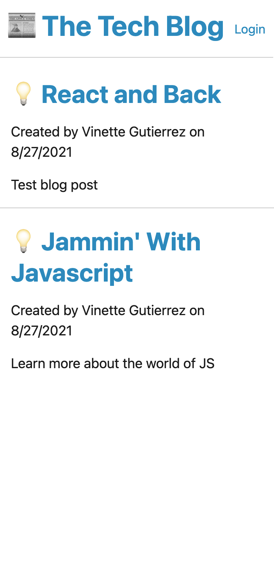
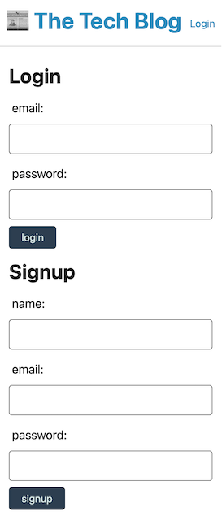
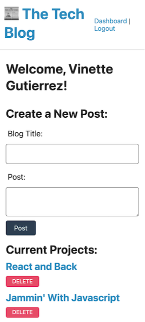

# mvc_techblog_vgutierrez
Project 14 - Tech Blog

# Description

This is a full stack tech blog that will allow a user to create a login, add and delete personal blog posts, view others blog posts, logout and log in again. 

# Table of Contents

- [Installation](#installation)
- [Usage](#usage)
- [License](#license)
- [Contributers](#contributers)
- [Test Instructions](#test-instructions)
- [Questions](#questions)

# Installation

This is the first installation of this tool.

# Usage

- This tool can be used to create and share news as a community. 

# License

- MIT

# Contributers

- Vinette Gutierrez

# Test Instructions

Check out the deployed page [here](https://fathomless-waters-68318.herokuapp.com/)

# Questions

- [Github Link](https://github.com/vinetteg/mvc_techblog_vgutierrez)
- For additional questions, please contact me via email at vinette.gutierrez@gmail.com